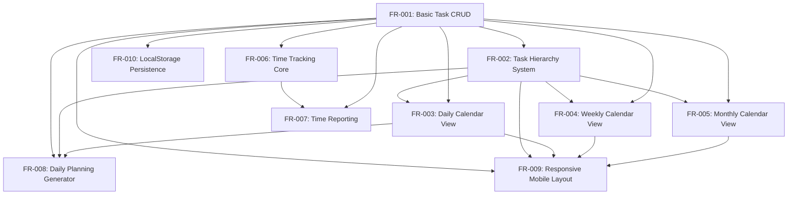

# Project Requirements and Planning (PRP): Advanced Personal Task Manager

## Overview

This PRP serves as the orchestrator for the feature-decomposed implementation of the Advanced Personal Task Manager. Instead of containing all implementation details directly, this document provides high-level context and coordinates the execution of individual feature requests.

## Project Context

The Advanced Personal Task Manager is a sophisticated web application that helps users organize tasks, track time, and plan their schedule effectively. It features hierarchical task organization, multiple calendar views, time tracking, and automated planning capabilities.

## Feature Decomposition

This project has been decomposed into the following features:

| ID | Name | Status | Dependencies |
|----|------|--------|-------------|
| FR-001 | Basic Task CRUD | planned | None |
| FR-002 | Task Hierarchy System | planned | FR-001 |
| FR-003 | Daily Calendar View | planned | FR-001, FR-002 |
| FR-004 | Weekly Calendar View | planned | FR-001, FR-002 |
| FR-005 | Monthly Calendar View | planned | FR-001, FR-002 |
| FR-006 | Time Tracking Core | planned | FR-001 |
| FR-007 | Time Reporting | planned | FR-001, FR-006 |
| FR-008 | Daily Planning Generator | planned | FR-001, FR-002, FR-003 |
| FR-009 | Responsive Mobile Layout | planned | FR-001, FR-002, FR-003, FR-004, FR-005 |
| FR-010 | LocalStorage Persistence | planned | FR-001 |

## Feature Dependency Graph

## Implementation Strategy

The implementation will follow these principles:

1. Features will be implemented in dependency order, starting with FR-001 (Basic Task CRUD)
2. Each feature will follow the TDD/BDD workflow with Red-Green-Refactor cycles
3. Integration tests will verify cross-feature functionality, especially between task management and calendar views
4. Features will be validated individually and as part of the overall system
5. Mobile responsiveness will be considered throughout implementation but finalized in FR-009

## Execution Plan

1. Implement core data management (FR-001, FR-002, FR-010)
2. Implement visualization features (FR-003, FR-004, FR-005)
3. Implement productivity features (FR-006, FR-007, FR-008)
4. Implement responsive design (FR-009)
5. Validate complete system with integration tests

## Success Criteria

The implementation will be considered successful when:

1. All individual features pass their validation gates
2. All integration tests pass
3. The system provides a seamless user experience across all features
4. The application works correctly on both desktop and mobile devices
5. Data persistence works reliably with LocalStorage

## Progress Tracking

Current progress:
- Total Features: 10
- Completed Features: 0
- Completion Percentage: 0%
- Overall Confidence: 0.0

## References

- Feature Registry: `2-docs/features/feature-registry.json`
- Individual Feature Requests: `2-docs/features/FR-XXX-feature-name.md`
- Integration Tests: `tests/integration/`
