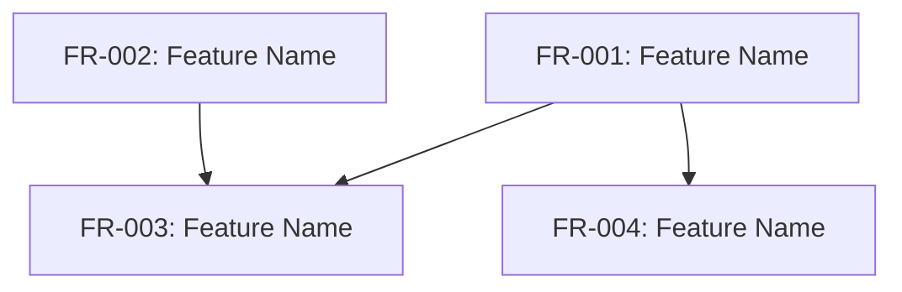

# Project Requirements and Planning (PRP): [PROJECT_NAME]

## Overview

This PRP serves as the orchestrator for the feature-decomposed implementation of [PROJECT_NAME]. Instead of containing all implementation details directly, this document provides high-level context and coordinates the execution of individual feature requests.

## Project Context

[PROJECT_CONTEXT_DESCRIPTION]

## Feature Decomposition

This project has been decomposed into the following features:

| ID | Name | Status | Dependencies |
|----|------|--------|-------------|
| FR-001 | [FEATURE_NAME] | [STATUS] | [DEPENDENCIES] |
| FR-002 | [FEATURE_NAME] | [STATUS] | [DEPENDENCIES] |
| FR-003 | [FEATURE_NAME] | [STATUS] | [DEPENDENCIES] |

## Feature Dependency Graph

## Implementation Strategy

The implementation will follow these principles:

1. Features will be implemented in dependency order
2. Each feature will follow the TDD/BDD workflow
3. Integration tests will verify cross-feature functionality
4. Features will be validated individually and as part of the overall system

## Execution Plan

1. Implement core features (FR-001, FR-002)
2. Implement dependent features (FR-003, FR-004)
3. Implement integration tests
4. Validate complete system

## Success Criteria

The implementation will be considered successful when:

1. All individual features pass their validation gates
2. All integration tests pass
3. The system meets the overall project requirements
4. The system achieves the desired quality metrics

## Progress Tracking

Current progress:
- Total Features: [TOTAL_FEATURES]
- Completed Features: [COMPLETED_FEATURES]
- Completion Percentage: [COMPLETION_PERCENTAGE]%
- Overall Confidence: [OVERALL_CONFIDENCE]

## References

- Feature Registry: `2-docs/features/feature-registry.json`
- Individual Feature Requests: `2-docs/features/FR-XXX-feature-name.md`
- Integration Tests: `tests/integration/`
